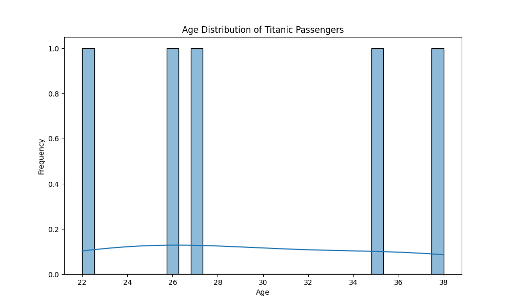
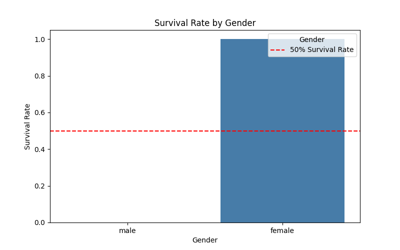
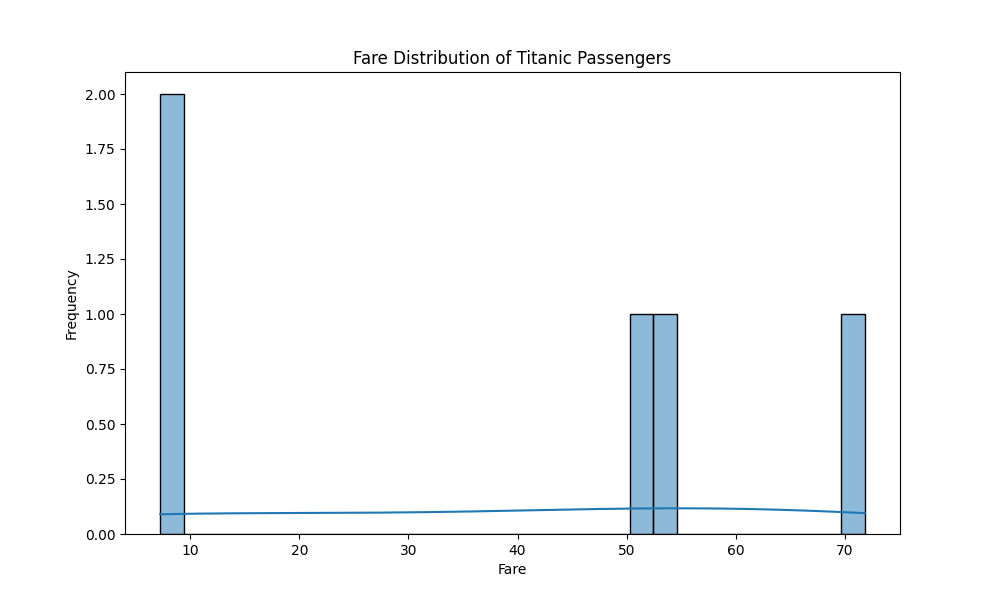

# Project 6: Custom EDA

## Project Overview
Project 6 integrates Python and Markdown to create a data story in a Jupyter Notebook. The project includes a virtual environment with popular libraries for data analytics, including pandas, matplotlib, and seaborn, and follows a common process for exploratory data analysis (EDA) projects.

## Dataset Overview
For this project, we will be using the Titanic Dataset from Kaggle, which includes information about passengers aboard the Titanic and their survival status.

## Data Sources
- NOAA Storm Events
- U.S. Census Bureau Carto Boundary File

## Metadata
- **Information about the database**: [NOAA Storm Events Metadata](https://www.ncdc.noaa.gov/stormevents/faq)
- **Database structure changes**: The structure from NOAA was changed in 1996. Only the years 1998-2024 are included in this download.
 # https://www.ncdc.noaa.gov/stormevents/faq

https://www.ncdc.noaa.gov/stormevents/details.jsp
## Questions to Explore
- What states have the most events related to thunderstorms?
- Do some states have more tornadoes than others?
- Do stronger tornadoes result in more deaths?

## Steps for EDA

Perform exploratory data analysis (EDA) using pandas and other tools as needed. The following steps outline the process followed in this project:

1. **Data Acquisition**
   - Loaded the Titanic dataset from `titanic.csv`.

2. **Initial Data Inspection**
   - Displayed the first few rows of the dataset using `df.head()`.
   - Checked for missing values, data types, and duplicates.

3. **Initial Descriptive Statistics**
   - Generated summary statistics using `df.describe()` to understand key metrics.

4. **Initial Data Distribution for Numerical Columns**
   - Visualized the distribution of numerical columns (e.g., Age, Fare) using histograms.
   - Plotted the Age distribution:
     

5. **Initial Data Distribution for Categorical Columns**
   - Visualized survival rates by gender using bar charts:
     

6. **Initial Data Transformation and Feature Engineering**
   - Applied one-hot encoding to the `Embarked` column using `pd.get_dummies()`.

7. **Initial Visualizations**
   - Created visualizations to explore relationships in the data, including the Fare distribution:
     

8. **Initial Storytelling and Presentation**
   - **Insights:**
     - Females had a higher survival rate compared to males.
     - The fare distribution shows that most passengers paid a lower fare, with a few outliers paying significantly more.
   - **Implications:**
     - These insights highlight disparities in survival chances based on gender and socio-economic status among passengers.
   - **Future Work:**
     - Additional analyses could explore the impact of age and class on survival rates, as well as correlations with other variables.

## Visualizations
Consider adding relevant visualizations such as graphs or charts to illustrate your findings. You can use libraries like matplotlib or seaborn to create these visualizations and save them as images for your report.

## Lessons Learned
- Don't try to upload large CSV files to GitHub; it can be cumbersome to manage.
- Data format is crucial; mismatched data types can complicate analysis.

## Getting Started
### Create and Activate Project Virtual Environment
To set up your project environment, run the following commands in your terminal:

```bash
py -m venv .venv
.venv\Scripts\Activate
```
## Conclusion

In this exploratory data analysis (EDA) project using the Titanic dataset, we discovered the following key insights:

- **Higher Survival Rate for Females:** Females had a significantly higher survival rate compared to males, highlighting gender disparities in survival chances during the disaster.
- **Fare Distribution:** Most passengers paid a lower fare, with some outliers who paid significantly more, indicating socio-economic differences among passengers.

### Implications

These findings underline the disparities in survival chances based on gender and socio-economic status among Titanic passengers.

### Future Work

Further analyses could explore the impact of age and passenger class on survival rates, as well as correlations with other variables.

For a detailed analysis and visualizations, please refer to the Jupyter Notebook: [elen_eda.ipynb](elen_eda.ipynb).

## https://github.com/Elen-tesfai/datafun-06-eda/blob/main/README.md